<div align="center">
<h1 >
  <br/>OpenDigger可视化大屏
</h1>


[](README.md)


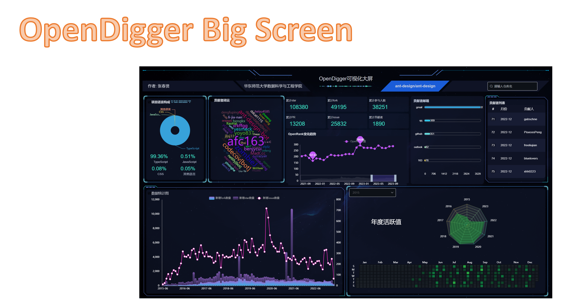

OpenDigger可视化大屏由 无监督学习队, 该项目是[OpenSODA](https://competition.atomgit.com/competitionInfo?id=bc6603e0b8bf11ed804e6b78b4426d45)大赛的决赛作品


## 关于本项目

一个在线可访问, 可交互的可视化大屏. 数据来源于[X-lab2017/open-digger](https://github.com/X-lab2017/open-digger) 与 [Github API](https://docs.github.com/en/rest)

该项目由Vue支持, 在线访问地址:  [http://open-digger.com/#/](http://open-digger.com/#/)

你只需要在浏览器输入地址 http://open-digger.com/#/ , 即可在线访问

## 怎么查看OpenDigger 可视化大屏?

+ 你只需要在浏览器输入地址 http://open-digger.com/#/ , 即可在线访问

### Docker部署

1. 安装Docker：请确保系统上已经安装了Docker。他们可以按照官方文档中的说明进行安装：https://docs.docker.com/get-docker/

2. 拉取镜像：你可以使用以下命令从Docker Hub上拉取上传的镜像

   docker镜像地址: https://hub.docker.com/repository/docker/beinvisibling/opendiggerbigscreen/general

   ```bash
   docker pull beinvisibling/opendiggerbigscreen:latest
   ```

   这将从Docker Hub下载并在他们的本地系统上存储您的镜像。

3. 运行容器：你可以使用以下命令来运行您的镜像：

   ```bash
   docker run -d -p 8081:8081 your-dockerhub-username/your-image-name
   ```

   - `-d` 标志表示在后台运行容器。
   - `-p 8080:3000` 标志将容器的端口 8081 映射到主机的端口 8081。这是假设您的Node.js应用程序在容器中使用的端口是8081。

4. 访问应用程序：一旦容器正在运行，你就可以通过在浏览器中访问 `http://localhost:8081` 来访问您的Node.js应用程序。如果你在主机的其他端口上映射了容器端口，你需要相应地更改URL中的端口号。

这样，你就可以在他们的本地系统上运行和访问OpenDigger可视化大屏应用程序镜像了。可以使用 `docker stop container-id` 命令，其中 `container-id` 是容器的ID，可以使用 `docker ps` 命令查看。


## OpenDigger可视化大屏介绍

### 场景与意义

世界需要开源, 开源需要被更多人看到, 要有更多人参与到开源中来. 本项目跳出开源一般意义上从代码的角度, 选择从更容易让大众理解和接收的视觉角度,吸引观众的注意力, 从可视化大屏角度去宣传开源, 更容易让普通人理解与接受. 因为普通人, 就算不懂代码与编程, 也能参与到开源中来.

### 实现方案

本大屏的数据来源于 

- [X-lab2017](https://github.com/X-lab2017)
- [Github API](https://docs.github.com/en/rest)

技术栈: Vue 2.6  Echarts 5.3  RestFul API

### 作品介绍

整个大屏的缩略图如下, 其中包含一些动态操作


### 作品特色

#### 数据来源广泛

本大屏的数据来源于 

- [X-lab2017](https://github.com/X-lab2017)
- [Github API](https://docs.github.com/en/rest)

其中X-Lab2017中的API包含种类繁多的开源项目的各种信息, 信息如下

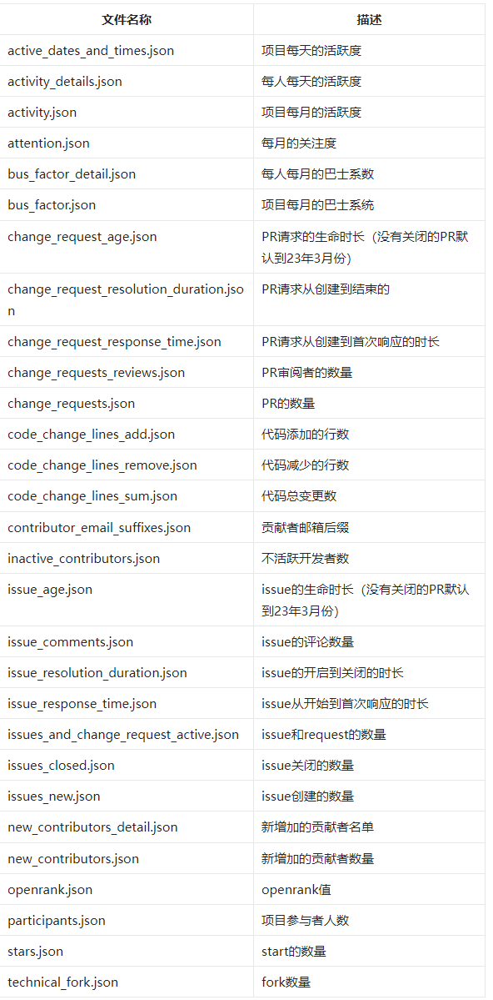

而Github API还可以查到一些额外的信息, 如项目语言分布图

#### 动态交互查询

## 网站是动态可变, 有交互的!

## 网站是动态可变, 有交互的!

## 网站是动态可变, 有交互的!

不同于一般的可视化大屏, 本项目是可以进行查询的, 可以根据不同的开源项目展现不同的界面, 我们可以根据我们可以根据项目作者和项目名称对项目记性可视化查询.

查询的动作如下

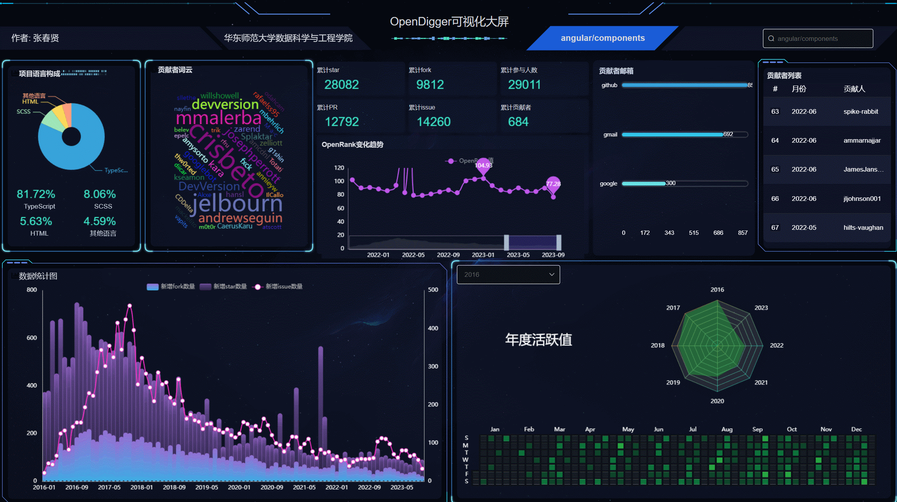

输入查询后, 比如查询**apache/arrow**项目, 就会从其他仓库的图表切换过来.

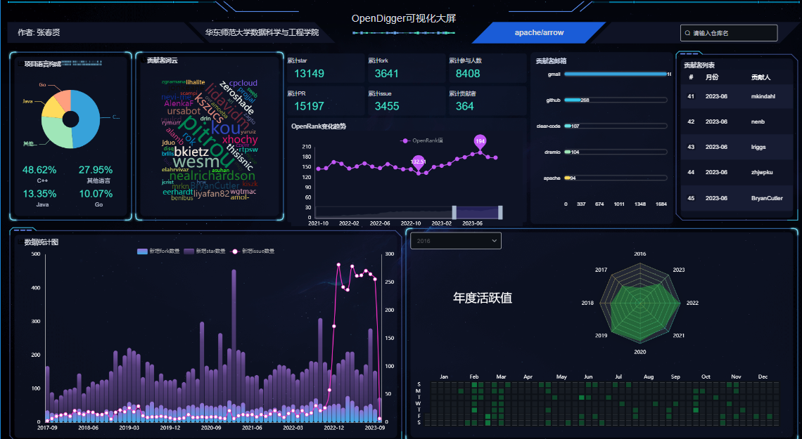

并且在每个项目下可以查询对应年份的活跃度

2016年apache/arrow活跃度

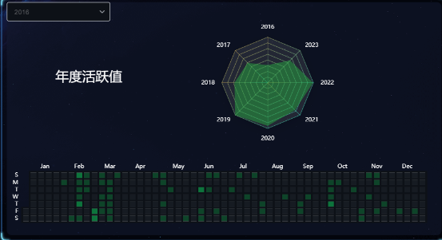

2017年apache/arrow活跃度

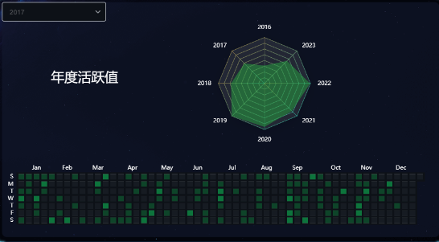

#### 图表可交互

每一个图表, 在鼠标划过去的时候都是可以有运行的, 如波浪滚动, 列表滚动, 数值显示, 放大等.

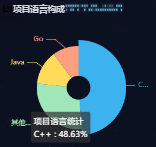

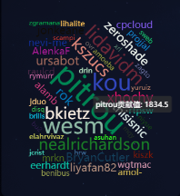

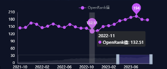

### 图表解释

#### **项目语言构成**

通过Github API查询, 可以查到一个项目的语言构成情况, 对项目的技术栈有个基本的了解.

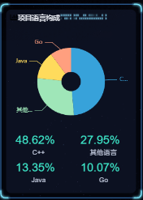

#### 贡献者词云

可以通过查看词云来了解各位开源大佬的贡献情况, 字越大代表贡献越多

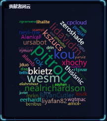

#### 项目基本信息一览

查询项目的star, fork, 参与人数, issue, 贡献者数量, 看它就对了!

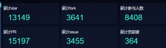

#### OpenRank趋势

openRank是由OpenDigger独创的开源项目指标, 本大屏把它的变化趋势展示了出来

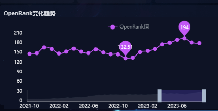

#### 贡献者邮箱

通过贡献者邮箱列表, 可以了解到贡献者的一些国籍信息. 如gmail通常是欧美人, 163和qq通常是国人.

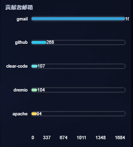

#### 贡献者列表

可以查看贡献的大佬的名单! 而且是滚动名单

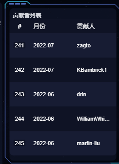

#### 数据统计图

从star, fork和issue新增数量的角度, 查看一个开源项目的流行趋势, 三者越高越受欢迎!

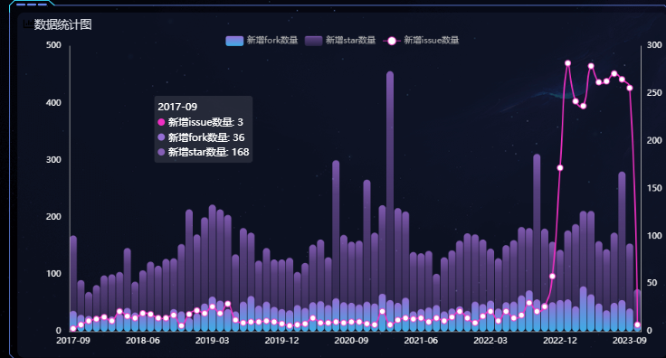

#### 年度活跃图

仿Github热力图, 开业查看项目的更新情况

雷达图可以查看项目的年度活跃情况, 让你对开源项目更好了解!

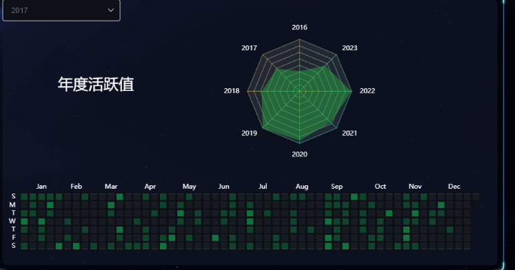

### 比赛收获

收获了一个完整的可视化项目经验, 从头到尾规划了如何更好的展示开源项目, 为开源助力

### 演示视频

