<div align="center">
<h1 >
  <br/>OpenDigger Big Screen
</h1>


[](README-CN.md)


The Big Screen is developed by Unsupervised Learning Group in [OpenSODA](https://competition.atomgit.com/competitionInfo?id=bc6603e0b8bf11ed804e6b78b4426d45) competition.


## About this project

An online accessible, interactive visualization screen. Data from X-lab2017/open-digger and Github API.

The project is powered 🚀 by Vue, and is available online at:   [http://open-digger.com/#/](http://open-digger.com/#/)

## How to view ?

+ All you need to do is just to type in the address http://open-digger.com/#/ into your browser and you can access it online!

### Docker deployment

1. Install Docker: Make sure Docker is installed on your system. they can follow the instructions in the official documentation: https://docs.docker.com/get-docker/

2. Pull images: You can pull uploaded images from Docker Hub using the following command

   docker image address : https://hub.docker.com/repository/docker/beinvisibling/opendiggerbigscreen/general

      ```bash
      docker pull beinvisibling/opendiggerbigscreen:latest
      ```

     This will download and store your image from Docker Hub on their local system.

3. Run the container: you can run your image using the following command:

      ```bash
      docker run -d -p 8081:8081 your-dockerhub-username/your-image-name
      ```

      - The `-d` flag indicates to run the container in the background.
      - The ``-p 8080:3000`` flag maps the container's port 8081 to the host's port 8081.This assumes that your Node.js application is using port 8081 in the container.

4. accessing the application: once the container is running, you can access your Node.js application by going to `http://localhost:8081` in your browser. If you have mapped the container port on another port on the host, you need to change the port number in the URL accordingly.

This way, you will be able to run and access the OpenDigger l big screen application image on their local system. You can use the `docker stop container-id` command, where `container-id` is the ID of the container, which can be viewed using the `docker ps` command.

## The introduction of OpenDigger Big Screen


# 1. 项目简介

本项目使用了OpenDigger官方的数据集top300_metrics(前300流行项目指标数据), 云存储技术, 容器技术, 云主机在线部署技术, 多项技术共同完成了一个有关OpenDigger的可视化大屏


项目地址: http://81.69.3.48:8080/#/ 

docker镜像地址: https://hub.docker.com/repository/docker/beinvisibling/opendiggerbigscreen 

# 2 项目介绍

## 2.1 项目概览

整个大屏的缩略图如下

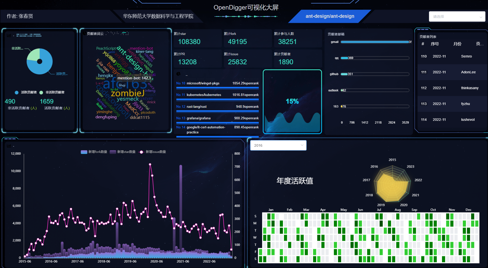

可以看出, 整个项目看上去十分酷炫, 图表众多, 且每个图表都与开源项目和数据集之间有联系


## 2.2 项目特色

### 2.2.1 动态查询交互


## 网站是动态可变, 有交互的!

## 网站是动态可变, 有交互的!

## 网站是动态可变, 有交互的!

不同于一般的可视化大屏, 本项目是可以进行查询的, 基于top300_metrics(前300流行项目指标数据), 我们可以根据项目组织和项目名称进行项目查询

下面是一般查询的截图

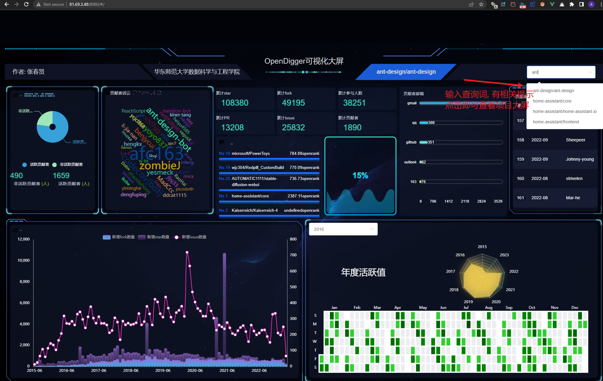

输入查询后, 比如查询angular/components, 即可跳出专属于angular/components项目的大屏

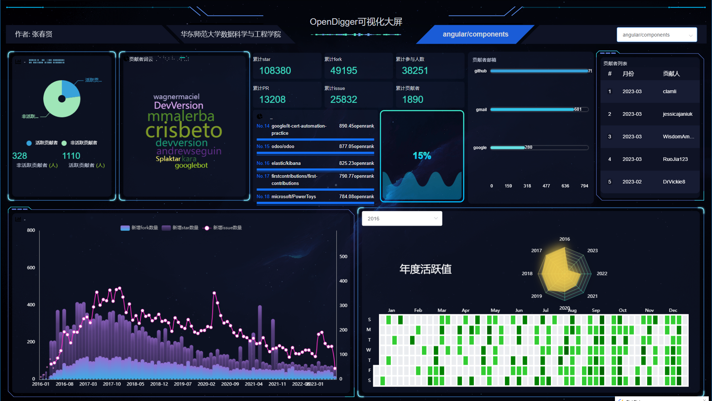

并且在每个项目下可以查询对应年份的活跃度

2016年angular/components活跃度

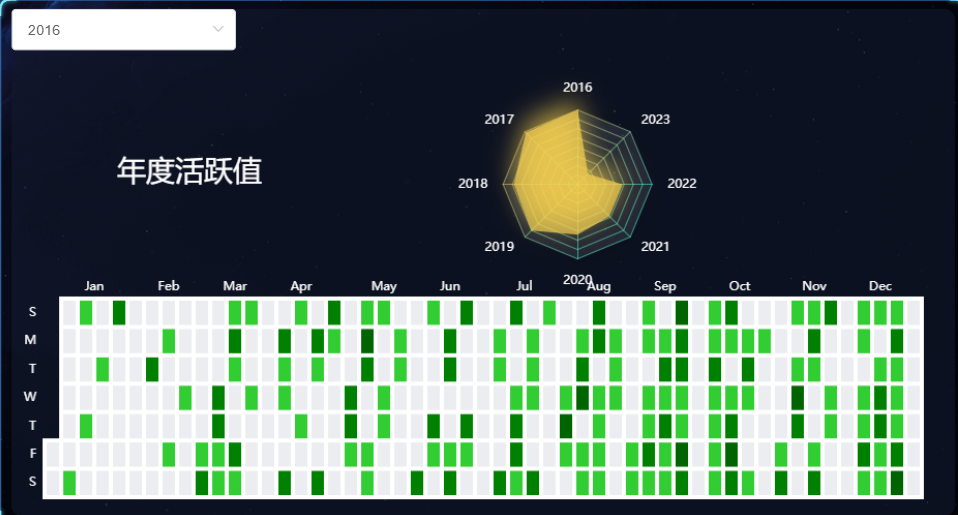

2017年angular/components活跃度

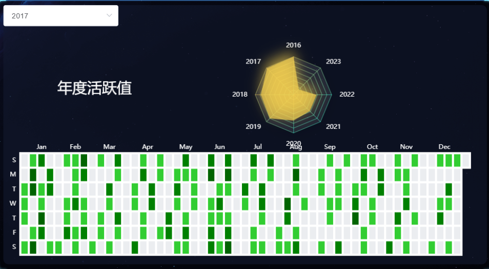

## 2.2.2 轻松部署

本项目由github仓库 https://github.com/ZhangChunXian/OpenDiggerBigScreen

docker镜像 https://hub.docker.com/repository/docker/beinvisibling/opendiggerbigscreen/general

docker拉取镜像

```docker
docker pull beinvisibling/opendiggerbigscreen:latest
```


### 2.2.3 图表可交互

每一个图表, 在鼠标划过去的时候都是可以有运行的, 如波浪滚动, 列表滚动, 数值显示, 放大等.

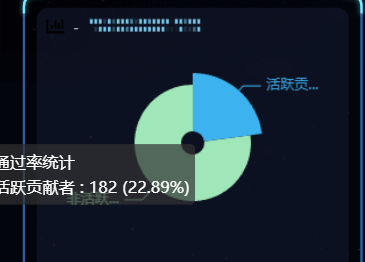

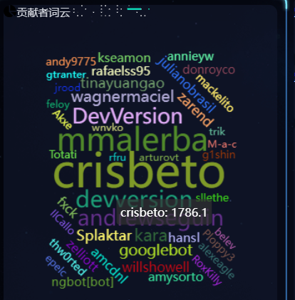

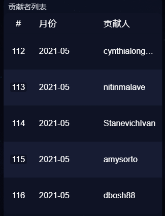

### 2.2.4 云存储技术

本项目的数据都不是在本地,而是存储在腾讯云oss中, 这不仅保障了存储的速度, 还保障了存储的稳定性和安全性. 

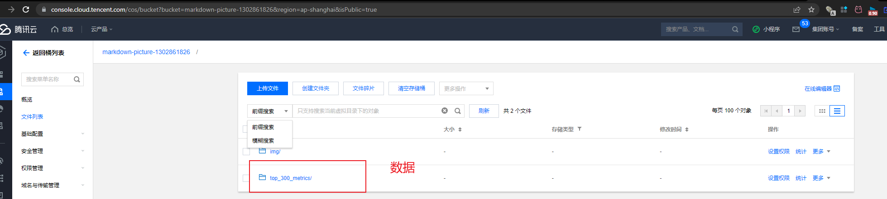

## 2.3 图表解释

### 2.3.1 footer

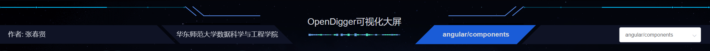

footer表示网站主题 OpenDigger可视化大屏, 并标明版权, 右面有搜索框


### 2.3.1 饼图

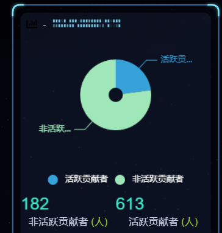

饼图描述了非活跃非活跃贡献者和活跃贡献者的比例和数量


### 2.3.2 贡献者词云

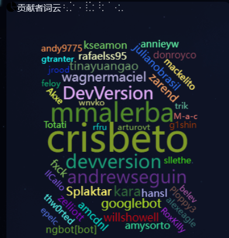

贡献者词云描述了贡献者的情况, 字越大说明贡献越多


### 2.3.3 项目基本信息


累计star, 累计fork, 累计参与人数, PR, issue和贡献者

### 2.3.4 OpenRank值列表和水球图

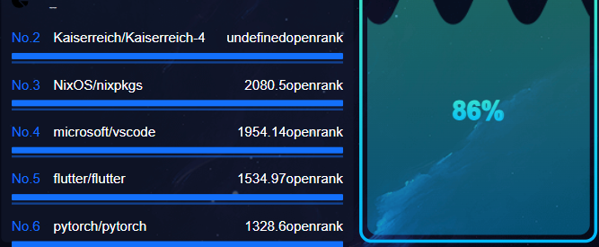

列表列出了Openrank值最高的项目前20, 而水球图描述了项目的openRank排名, 如这个项目排名在86%


### 2.3.4 贡献者邮箱胶囊图

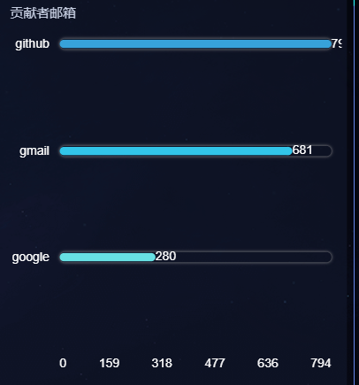

贡献者邮箱胶囊图描述了贡献者使用的邮箱情况


### 2.3.5 贡献者列表胶囊图

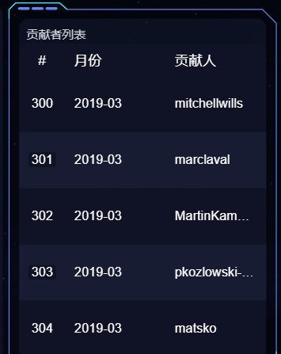

从前到后列出贡献者


### 2.3.6 新增fork数量, star, 和issue数量折线图/柱状图

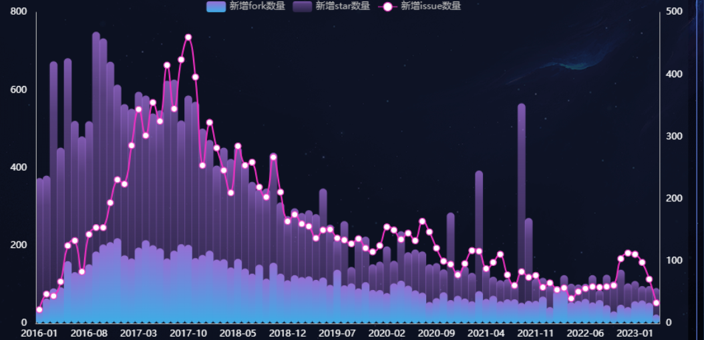

描述项目自成立以来新增fork, issue和star的情况, 三个放在一起比信息量更大, 更加容易得出结论


### 2.3.7 年度活跃值热力图和雷达图

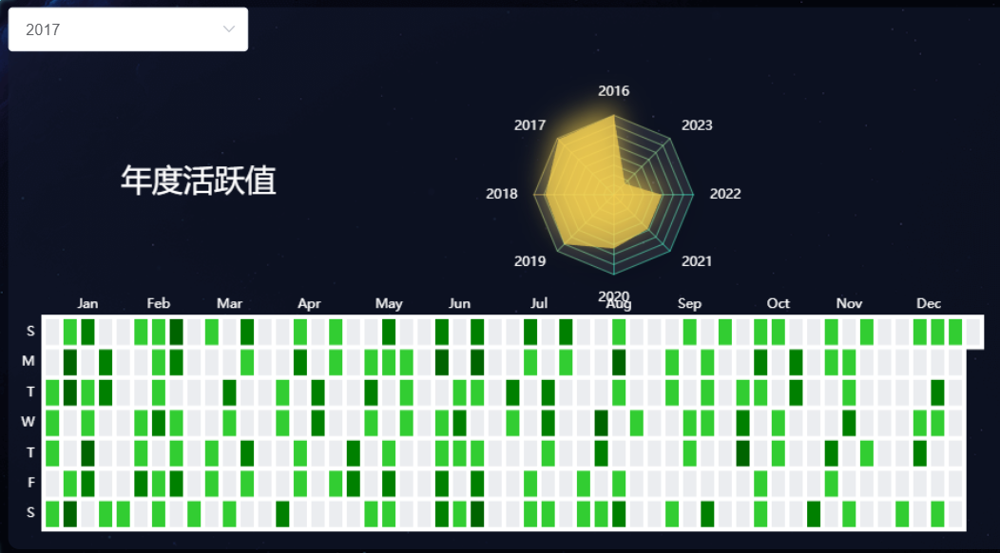

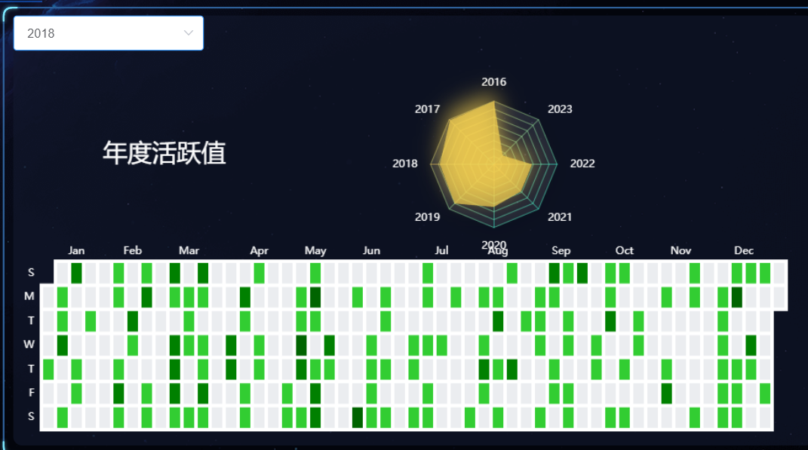

热力图模仿了github的提交热力图, 描述了改项目在某年的提交情况, 灰色表示没有提交, 绿色颜色越深表示提交越多.

雷达图对比了从项目成立以来每年的活跃值, 放在一起对比

此外, 热力图支持交互, 输入不同年份, 返回对应的年份热力图


感谢助教和老师!!